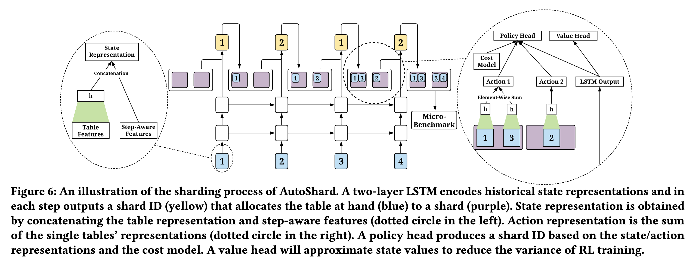

# [KDD 2022] AutoShard: Automated Embedding Table Sharding for Recommender Systems
This is the implementation for the paper [AutoShard: Automated Embedding Table Sharding for Recommender Systems](https://dl.acm.org/doi/abs/10.1145/3534678.3539034). We proposed a reinforcement learning approach for embedding table sharding in distributed recommender systems, which aims to put emebedding tables to multiple GPU devices to achieve a load balance. Please refer the paper for more deteails.


## Cite this Work
If you find this project helpful, please cite
```bibtex
@inproceedings{zha2022autoshard,
  title={AutoShard: Automated Embedding Table Sharding for Recommender Systems},
  author={Zha, Daochen and Feng, Louis and Bhushanam, Bhargav and Choudhary, Dhruv and Nie, Jade and Tian, Yuandong and Chae, Jay and Ma, Yinbin and Kejariwal, Arun and Hu, Xia},
  booktitle={KDD},
  year={2022}
}
```

## Installation

**Step 1: install PyTorch**
```
pip3 install torch
```

**Step 2: install FBGEMM**

Follow the instructions in [https://github.com/pytorch/FBGEMM](https://github.com/pytorch/FBGEMM) to install the embedding operators

**Step 3: install AutoShard**
```
pip3 install -r requirements.txt
pip3 install -e .
```

## Run AutoShard on Synthetic Data

**Step 1: download DLRM dataset**

Download the data with `git lfs` at [https://github.com/facebookresearch/dlrm_datasets](https://github.com/facebookresearch/dlrm_datasets)

**Step 2: process the dataset**
```
python3 gen_dlrm_data.py
```
Note that you need to change `--data` argument to the path of the downloaded DLRM dataset.

**Step 3: train AutoShard**
```
python3 run_autoshard.py
```
Note that you need to specify `--gpu-devices` and `--max-memory` based on your GPU.

**Step 4: evaluate AutoShard**
```
python3 eval.py --alg autoshard
```
Not that you need to specify `--gpu-devices` and `--max-memory` based on your GPU.

## Run Baselines
```
python3 eval.py --alg random
python3 eval.py --alg dim_greedy
python3 eval.py --alg lookup_greedy
python3 eval.py --alg size_greedy
```
Note that you need to specify `--gpu-devices` and `--max-memory` based on your GPU.
